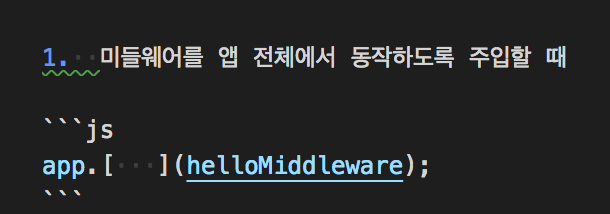
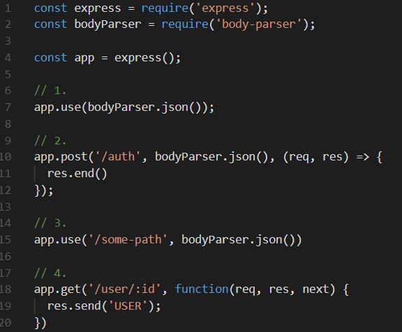
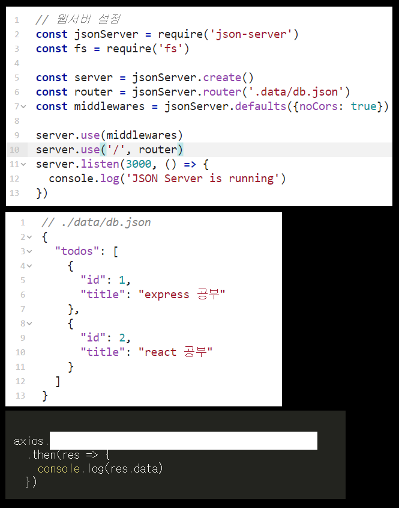

## 다음 중 Middleware 가 하는 일이 아닌 것은?

1.  모든 코드를 실행합니다.
2.  틀린 문법을 찾아줍니다.
3.  요청-응답 주기를 종료합니다.
4.  스택 내의 그 다음 미들웨어를 호출합니다.

> 정답 : 2 번

Middleware 가 하는 일은 아래와 같습니다.

* 모든 코드를 실행합니다.
* 요청 및 응답 오브젝트에 대한 변경을 실행합니다.
* 요청-응답 주기를 종료합니다.
* 스택 내의 그 다음 미들웨어를 호출합니다.

 

## 다음 중 Middleware 의 특징으로 잘못된 것은?

1.  등록된 순서대로 실행됩니다.
2.  request 객체, response 객체를 조작해서 기능 구현합니다.
3.  함수, 즉 안에서 어떤 작업이든 가능합니다.
4.  next 함수를 작성하지 않아도 다음 미들웨어가 자동으로 실행이 됩니다.
5.  request 객체, response 객체, next 함수를 인자로 받습니다.

> 정답 : 4 번

미들웨어는 next 함수를 호출을 안해주면 정지된 상태로 방치됩니다.

 

## 라우트 핸들러에서도 미들웨어가 할 수 있는 일을 처리할 수 있는데 그럼에도 미들웨어를 사용하는 이유로 올바른 것을 모두 고르시오!

1.  미들웨어가 메모리를 낮게 잡아먹으므로 성능의 최적화를 위해서 사용합니다.
2.  미들웨어가 더 많은 기능을 지원해서 사용합니다.
3.  Validator 를 지원하여 틀린 문법이 있으면 Log 를 띄어줘서 편해서 사용합니다.
4.  여러 라우터에서 중복 작성하는 불편을 덜기 위해서 사용합니다
5.  코드의 재사용성을 높이기 위해서 사용합니다.

> 정답 : 4, 5 번

미들웨어로 할 수 있는 모든 일은 라우트 핸들러에서도 할 수 있으나, 
여러 라우터에서 사용해야 하는 기능을 중복 작성하는 불편을 덜고 
코드를 재사용하기 위해 미들웨어를 사용하는 것입니다. 

 

## 다음중 쿠키에 관련된 올바른 설명을 모두 고르시오

1.  로그인된 상태에서 쿠키가 만료될 경우 로그아웃이 된다.
2.  쿠키는 브라우저에 저장되는 것이 아니라 서버에 저장하고 불러오는 것이다.
3.  세션보다 보안성이 좋아서 은행업무나 공인인증이 필요한 정부사이트에서 많이 사용한다.
4.  자바스크립트로 쿠키를 읽고 쓸 수 있는데, 자바스크립트를 쓰게되면 보안 상 문제를 일으킬 수 있다.
5.  쿠키는 많은 용량을 지원하여 많은 글자수를 저장할 수 있도록 해준다.

> 정답 : 1, 4 번

2 번] 세션에 대한 설명입니다. 
3 번] 쿠키는 4000 바이트 내외(영문 4000 자, percent encoding 된 한글 444 자 가량)밖에 저장하지 못합니다 
5 번] 세션에 대한 설명입니다. 쿠키는 보안성이 약해 스니핑(sniffing)과 같은 공격을 받게될경우 개인정보를 해커에게 뺏길 수 있습니다. 

 

## 라우터 핸들러도 Middleware 다?

> 정답 : O

라우터 핸들러도 미들웨어입니다.

 

## 쿠키는 클라이언트 로컬(웹 브라우저)에 저장되는 키와 값이 들어있는 작은 데이터 파일이다?

> 정답 : O

쿠키는 클라이언트 로컬(웹 브라우저)에 저장되는 키와 값이 들어있는 작은 데이터 파일입니다. 
쿠키에는 이름, 값, 만료날짜(쿠키 저장지간), 경로 정보, 접근 권한등 다양한 옵션이 들어있습니다. 
쿠키는 일정시간동안 데이터를 저장할 수 있습니다. (로그인 상태 유지에 활용합니다.) 
쿠키는 클라이언트의 상태 정보를 로컬에 저장했다가 참조합니다. 

 

## 다음 중 틀린 설명을 고르시오

1.  Json-Server 는 보안 기능이 약하고 느려서 실무에서 쓸수 없지만 간단히 벡엔드 기능이 필요할 때 유용하다
2.  Axios 의 Patch 메소드는 자료의 전체를 교체하고 싶을 때 사용하는 메소드이다.
3.  Ajax 의 단점으로는 클라이언트 구현이 복잡하는 점이 있다.
4.  Axios 의 Put 메소드는 자료의 전체를 교체하고 싶을 때 사용하는 메소드이다.

> 정답 : 2 번

Axios 의 Patch 메소드는 자료의 일부내용만 변경하고 싶을 때 사용하는 메소드입니다.

 

## 비동기적인 웹 어플리케이션의 제작을 위한 클라이언트 측 웹 개발 기법이였으나 요즘에는 의미가 변형되어 웹 브라우저에서 XMLHttpRequest 혹은 fetch 를 이용해서 보내는 HTTP 요청을 통칭하는 이것은 무엇일까요?

> 정답 : Ajax

Ajax 는 비동기적인 웹 어플리케이션의 제작을 위한 클라이언트 측 웹 개발 기법이였으나 
요즘에는 의미가 변형되어 웹 브라우저에서 XMLHttpRequest 혹은 
fetch 를 이용해서 보내는 HTTP 요청을 통칭하기도 합니다. 

 

## 다음 사진에 괄호안에 들어갈 메소드는 무엇일까요?

> 정답 : use

Express 내에서 미들웨어을 사용하고자 할 때는 use 메소드를 이용해서 미들웨어를 주입해줘야 합니다.

 

## Chrome Console 창에서 cookie 정보를 알고 싶을 때 어떤 명령어를 사용해야 확인할 수 있을까요?

> 정답 : document.cookie

document.cookie 라는 명령어로 손쉽게 cookie 정보를 얻을 수 있습니다.

 

## middleware 에 대한 설명으로 틀린 것은?

1.  request 객체, response 객체만 인자로 받을 수 있습니다.
2.  등록된 순서대로 실행됩니다.
3.  next 함수를 인자 없이 호출 할 수 있습니다.
4.  request 객체, response 객체를 조작해서 기능 구현합니다.

> 정답 : 1 번

request, response, next 함수를 인자로 받습니다.

 

## 쿠키의 한계점으로 틀린 것은?

1.  US-ASCII 밖에 저장하지 못합니다.
2.  4000 바이트 내외 밖에 저장하지 못합니다.
3.  서버에 저장됩니다.
4.  공유, 저장 되어야 하는 정보를 다루기에 부적절합니다.

> 정답 : 3 번

쿠키는 서버가 아닌 클라이언트(웹 브라우저)에 저장됩니다.

 

## Cookie 옵션에 해당 하지 않는 것은?

1.  Secure
2.  Domain
3.  Max-Age
4.  Paginate

> 정답 : 4 번

Paginate 는 JSON-Server 의 기능 중 하나입니다. 
 

쿠키 옵션 
 

Expires, Max-Age : 쿠키의 지속 시간 설정을 할 수 있습니다. 
Secure : HTTPS 를 통해서만 쿠키가 전송되도록 설정할 수 있습니다. 
HttpOnly : 자바스크립트에서 쿠키를 읽지 못하도록 설정할 수 있습니다. 
Domain, Path : 쿠키의 scope 설정합니다. (쿠키가 전송되는 URL 을 제한합니다.) 

 

## 자바스크립트로 쿠키를 읽고 쓰는 방법이 있지만 보안상 거의 사용되지 않는다. 자바스크립트에서 크키에 접근하지 못하도록 설정하는 옵션은?

1.  Secure
2.  Expires
3.  Cookie
4.  HttpOnly

> 정답 : 4 번

HttpOnly : 자바스크립트에서 쿠키를 읽지 못하도록 설정할 수 있습니다. 
Secure : HTTPS 를 통해서만 쿠키가 전송되도록 설정할 수 있습니다. 
Expries : 쿠키의 지속 시간 설정을 할 수 있습니다. 

 

## Ajax 의 장점으로 옳지 않은 것은?

1.  화면 전체를 다시 로드하지 않고도 내용을 갱신할 수 있어 더 나은 사용자 경험 제공합니다.
2.  서버의 응답을 기다리는 동안에도 여전히 웹 어플리케이션을 사용 가능합니다.
3.  클라이언트 구현이 간단해 집니다.
4.  필요한 자원만 서버에서 받아오게 되므로 트래픽이 줄어듭니다.

> 정답 : 3 번

Ajax 를 사용하게 되면 클라이언트 구현이 굉장히 복잡해 집니다.
그럼에도 불구하고 장점이 많아서 사용합니다.

 

## Status code 중 권한이 없음을 나타내는 code 는?

> 정답 : 403

4xx : 실패 - 클라이언트 책임 
 

400 Bad Request : 요청의 형태가 잘못되어 응답할 수 없습니다. 
401 Unauthorized : 인증이 되지 않았습니다. 
403 Forbidden : 요청한 자료에 접근할 권한이 없습니다. (인가가 되지 않았습니다.) 
404 Not Found : 요청한 자료가 없습니다. 

 

## 서버가 응답을 통해 웹브라우저에 저장하는 이름+값 형태의 정보를 무엇이라 하는가?

> 정답 : cookie

 

## 다음 중 Express 미들웨어에 대한 설명이 아닌것을 모두 고르세요.

1.  미들웨어 함수가 요청-응답 주기를 종료하지 않은 경우에는 `next()`를 호출하여야 한다.
2.  Express 는 등록된 순서에 따라 동작하지만 미들웨어를 사용한다면 로드 순서는 중요하지 않다.
3.  미들웨어 함수는 애플리케이션의 요청-응답 주기 중 그 다음의 미들 웨어 함수에 대한 액세스 권한을 갖는 함수이다.
4.  미들웨어 함수가 응답을 보내주거나 `next()`호출을 하지않으면 해당 요청에 대한 응답 상태 코드는 400 이다.
5.  미들웨어는 여러 라우터에서 사용해야 하는 기능을 중복 작성하는 불편을 덜고 코드를 재사용하기 위해 사용한다.

> 정답 : 2, 4 번

2 번] 미들웨어의 로드 순서는 중요하며, 먼저 로드되는 미들웨어 함수가 먼저 실행됩니다.(등록된 순서대로 실행됩니다.) 
4 번] 미들웨어 함수가 응답을 보내주거나 next() 호출을 하지 않으면 해당 요청은 정지된 채로 방치됩니다. (계속 응답을 기다립니다.) 

 

## 다음중 미들웨어를 처리 스택에 추가하는 방법이 아닌 것은?

> 정답 : 답이 없다

1 번] app.use(middleware)는 미들웨어를 전역 처리 스택에 추가하는 것입니다. 
2 번] app.METHOD('/PATH', middleware, function(req, res) { ... }) 는 미들웨어를 "METHOD /PATH" 처리 스택에 추가하는 것입니다. (특정 경로에만 동작하도록 주입하는 것) 
3 번] app.use('/PATH', middleware)는 미들웨어를 특정 경로('/PATH')에만 동작하도록 주입하는 것입니다. 
4 번] 라우트 핸들러도 미들웨어 입니다. 즉, next 함수를 인자로 받는 것이 가능합니다. 

 

## 다음 중 HTTP Cookie 에 대한 설명이 아닌 것은?

1.  서버가 응답을 통해 웹 브라우저에 저장하는 이름 + 값 형태의 정보
2.  저장소는 자료의 유효 기간과 접근 권한에 대한 다양한 옵션을 제공한다.
3.  여러 브라우저에 걸쳐 공유되어야 하는 정보, 혹은 웹 브라우저가 아닌 클라이언트에 저장되어야 하는 정보를 다루기에도 적절하다.
4.  브라우저는 같은 서버에 요청이 일어날때마다 해당 정보를 요청에 같이 실어 서버에 보낸다.
5.  4000 바이트 내외(영문 4000 자, percent encoding 된 한글 444 자 가량)밖에 저장하지 못한다.

> 정답 : 3 번

쿠키는 브라우저에 저장되는 것이므로 여러 브라우저에 걸쳐 공유되어야 하는 정보, 
혹은 웹 브라우저가 아닌 클라이언트(모바일 앱)에 저장되어야 하는 정보를 다루기에는 부적절합니다. 

 

## 서버는 브라우저에 저장하고 싶은 정보를 응답과 같이 실어 보냅니다.(Set-Cookie HTTP 응답 헤더) 이때, Set-Cookie 옵션에 대한 설명으로 맞지 않은 것은?

1.  Secure: 자바스크립트에서 쿠키를 읽지 못하도록 설정한다.
2.  Expires, Max-Age: 쿠키의 지속 시간을 설정한다.
3.  Domain, Path: 쿠키의 scope 설정(쿠키가 전송되는 URL 을 제한한다.)
4.  Expires 혹은 Max-Age 를 명시하지 않으면 클라이언트가 종료될때 생성된 쿠키는 삭제된다.
5.  HttpOnly 쿠키를 사용하면 쿠키에대한 Cross-site 스크립팅(XSS) 공격을 방지할 수 있다.

> 정답 : 1 번

Secure 쿠키는 HTTPS 프로토콜 상에서 암호화된 요청일 경우에만 전송되게 하는 옵션입니다. 
해당 내용은 HttpOnly 옵션에 대한 설명입니다. 

 

## 응답 상태 코드 중 (Response Status Code) 인증되었지만(authentication) 요청한 자료에 접근할 권한(authorization)이 없어 실패함을 나타내는 상태 코드는 무엇일까요?

1.  401
2.  404
3.  400
4.  403

> 정답 : 4 번

 

## 다음 중 Ajax 에 대한 설명으로 틀린 것은?

1.  화면 전체를 빠르게 다시 로드하여 더 나은 사용자 경험을 제공한다.
2.  서버의 응답을 기다리는 동안에도 여전히 웹 어플리케이션을 사용할 수 있다.
3.  클라이언트 구현이 굉장히 복잡해진다는 단점이 있다.
4.  필요한 자원만 서버에서 받아오게 되므로 트래픽이 줄어든다.
5.  요즘은 웹 브라우저에서 XMLHttpResuquest 혹은 fetch 를 이용해서 보내는 HTTP 요청을 통칭하기도 한다.

> 정답 : 1 번

Ajax 는 화면 전체를 다시 로드하지 않고도 내용을 갱신할 수 있어 더 나은 사용자 경험을 제공합니다.

 

## '이것은' 자원을 정의하고 자원에 대한 주소를 지정하는 방법 전반을 일컫는 말이다. 웹의 장점을 최대한 활용할 수 있는 네트워크 기반의 아키텍쳐의 한 형식으로 로이 필딩이 소개한 이것은 무엇인가? (예: URL 에 리소스의 확장자를 표시하지 않고 모든 리소스를 명사로 표현한다. )

> 정답 : REST

 

## HTTP 에서 요청 혹은 응답이 어떤 형태의 자료(리소스)인지를 나타내는 헤더는?

> 정답 : content-type

Content-Type 개체 헤더는 리소스의 media type 을 나타내기 위해 사용됩니다. 
응답 내에 있는 Content-Type 헤더는 클라이언트에게 반환된 컨텐츠의 컨텐츠 유형이 실제로 무엇인지를 알려줍니다. 
브라우저들은 어떤 경우에는 MIME 스니핑을 해서 이 헤더의 값을 꼭 따르지는 않을 겁니다. 
이를 막기 위해, X-Content-Type-Options 헤더를 nosniff 으로 설정할 수 있습니다. 
 

요청 내에서, (POST 혹은 PUT 처럼), 클라이언트는 서버에게 어떤 유형의 데이터가 실제로 전송됐는지를 알려줍니다. 

 

## json-server 를 사용해 간단한 시뮬레이션을 위한 REST API Mock server 를 구축한 상태에서 Axios 라는 HTTP Client 라이브러리를 사용해 요청을 보내려 합니다. (Axios 역시 CDN 이나 npm 설치를 통해 직접 불러왔다고 가정합니다.) './data/db.json'의 'todos' 에서 'id'가 2 인 데이터의 'title' 내용을 'axios 공부'로 수정하여 응답 데이터를 콘솔에 출력하려 합니다. axios 를 이용해 어떻게 요청해야 할지 빈칸을 채워주세요.

> 정답 : patch('/todos/2', {title: 'axios 공부'})

일부를 수정하고 싶을 때는 patch 메소드를, 전체를 교체하고 싶을 때는 put 메소드를 사용하면 됩니다.

 

## 다음 중 Middleware 와 관계없는 내용은 무엇인가?

1.  request 객체, response 객체, next 함수를 인자로 받음
2.  Ajax 에만 있는 개념
3.  Express 에만 있는 개념
4.  응답을 보내주거나 requset 를 호출하는것 두개 중 하나를 꼭 해주어야 한다
5.  등록된 순서대로 순차적으로 실행된다.

> 정답 : 2, 4 번

Express 에만 있는 개념이다, 
응답을 보내주거나 next 를 호출하는것 두개 중에 하나를 꼭 해주어야 한다.

 

## Set-Cookie option 중 다른 내용을 고르시오

1.  Secure : HTTPS 를 통해서만 쿠키가 전송되도록 설정
2.  HttpOnly : 자바스크립트에서 쿠키를 읽지 못하도록 설정
3.  Domain : 쿠키의 scope 설정
4.  Max-Age : 쿠키의 최대 값을 설정
5.  Expires : 쿠키의 지속 시간 설정

> 정답 : 4 번

Max - Age : 쿠키의 지속 시간 설정

 

## 비동기적인 웹 어플리케이션의 제작을 위한 클라이언트 측 웹 개발 기법은 무엇인가?

> 정답 : Ajax

 

## Ajax 의 장점이 아닌 것은?

1.  화면 전체를 다시 로드하지않고 내용을 갱신할 수 있어 더 나은 사용자 경험 제공
2.  클라이언트 구현이 굉장히 단순해진다.
3.  서버의 응답을 기다리는 동안에도 여전히 웹 어플리케이션을 사용 할 수 있다.
4.  필요한 자원만 서버에서 받아오므로 트래픽이 줄어든다

> 정답 : 2 번

클라이언트 구현이 굉장히 복잡해지는 단점을 갖고 있다.

 

## helloMiddleware 라는 이름의 middleware 를 앱 전체에서 동작하도록 주입하려 한다. 어떤 코드를 써야 할까?

> 정답 : app.use(helloMiddleware)

 

## Cookie 와 관련된 내용으로 알맞은 것을 고르시오

1.  쿠키란 것은 서버가 요청을 통해 웹 브라우저에 저장하는 이름+값 형태의 정보이다.
2.  Cookie 를 많이 사용하면 크로스 사이트 스크립팅을 방지할수 있다
3.  저장소는 자료의 유효기간과 접근 권한에 대한 다양한 옵션을 제공한다.
4.  웹 브라우저는 쿠키를 저장하기 위한 저장소를 따로 가지고 있지는 않다.

> 정답 : 3 번

쿠키는 클라이언트 로컬(웹 브라우저)에 저장되는 키와 값이 들어있는 작은 데이터 파일입니다.

 

## Json 파일을 이용하여 간단한 시뮬레이션을 위한 REST API server 를 구축 할 수 있는 툴은 무엇인가?

> 정답 : Json-Server

 
